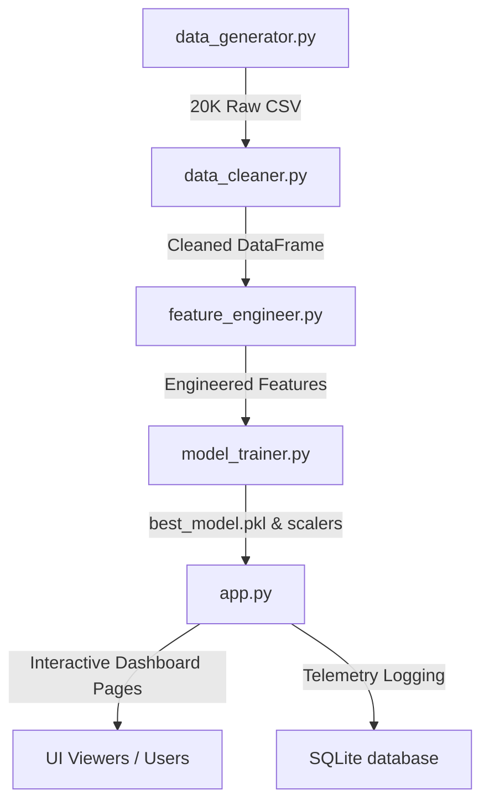

# 🏠 AI-Powered Real Estate Intelligence & Investment Platform
## Complete Project Documentation & Technical Architecture Report

---

## 1. Executive Summary & Overview
The **AI-Powered Real Estate Intelligence Platform** is a production-ready, end-to-end data science and machine learning application. It resolves a major challenge in real estate: determining whether a property is fairly valued, assessing its future appreciation potential, and quantifying investment risks.

By combining advanced regression algorithms (**CatBoost, XGBoost, LightGBM**) with explainable AI (**SHAP**), investment telemetry, and a conversational AI agent, this platform provides actionable, data-driven recommendations for buyers, sellers, and real estate investors.

### Tech Stack
*   **Core Logic:** Python 3.11+, Pandas, NumPy, SQLite
*   **Machine Learning:** Scikit-Learn, CatBoost, XGBoost, LightGBM, Joblib
*   **Explainable AI:** SHAP (SHapley Additive exPlanations)
*   **Visualization:** Plotly (Radar, Line, Bar, Gauges), Matplotlib
*   **Frontend UI:** Streamlit (Custom Slate Dark CSS/Aesthetics)

---

## 2. System Architecture & Data Flow
The platform is designed around a modular, decoupled architecture:



### Module Breakdown
1.  **`pipeline.py`**: The orchestration script that runs the data generator, cleaner, engineer, model training, and database initialization sequentially.
2.  **`src/`**: Contains the core algorithmic engines (Valuation, ROI, Risk, Forecasting, explainability).
3.  **`dashboard/`**: Holds UI layout pages (`pages/`) and cache loaders (`loader.py`).
4.  **`database/`**: Telemetry and historical predictions logger.

---

## 3. Data Engineering Pipeline

### A. Data Generation (`data_generator.py`)
Generates 20,000+ statistically realistic synthetic property records across 10 major Indian cities:
*   **Cities:** Mumbai, Delhi, Bangalore, Hyderabad, Chennai, Pune, Kolkata, Ahmedabad, Jaipur, Noida.
*   **Features generated:**
    *   *Property Specs:* Area (sq ft), BHK, Bathrooms, Age (years), Floor, Total Floors, Furnishing Status.
    *   *Location Metrics:* Distance to Metro (km), Distance to CBD (km), School Rating, Hospital Distance (km).
    *   *Macroeconomic Indicators:* Interest Rate (%), Inflation Rate (%), Local Development Index.
    *   *Target Variable:* `price` (derived via non-linear combination of specs, location, and economic factors + random Gaussian noise to prevent overfitting).

### B. Data Cleaning (`data_cleaner.py`)
*   Imputes missing values with median/mode (compatible with Pandas Copy-on-Write mode).
*   Handles extreme price outliers using IQR bounds.
*   Standardizes categorical variables.

### C. Feature Engineering (`feature_engineer.py`)
*   Creates custom columns: `price_per_sqft`, `bhk_density`.
*   Encodes categorical variables using one-hot encoding.
*   Scales numeric values using `StandardScaler` to prepare for models like Ridge.

---

## 4. Machine Learning Model Development

The platform trains and compares 6 distinct regression models using a **5-fold Cross-Validation** strategy:

| Model | Type | Strength / Use Case |
|-------|------|--------------------|
| **Ridge Regression** | Linear (Regularized) | Baseline, interpretable linear weights |
| **Random Forest** | Tree Ensemble | Captures non-linear feature interactions |
| **Gradient Boosting** | Boosting | Sequentially minimizes residuals |
| **XGBoost** | Optimized Boosting | Hyperparameter-tuned using `RandomizedSearchCV` |
| **LightGBM** | Leaf-wise Boosting | Extremely fast training on large data |
| **CatBoost** | Categorical Boosting | **Selected Primary Model** - Best generalization and handling of categorical data |

### Performance Evaluation Metrics
*   **R² Score:** Tells what percentage of price variance is explained by the features (Target > 90%).
*   **RMSE (Root Mean Squared Error):** Measures average dollar/rupee deviation of predictions.
*   **MAE (Mean Absolute Error):** Standard average absolute error.

All metrics are serialized into `models/saved/model_comparison.json`.

---

## 5. Core Valuation & Analytical Engines

The application does not just predict price; it uses specialized engines to convert the prediction into financial intelligence:

### A. Valuation Engine (`valuation_engine.py`)
Compares the predicted (fair value) price with the listed price to classify a property:
*   **Undervalued:** Listed price is $>5\%$ below predicted value. (Buy recommendation)
*   **Fairly Valued:** Listed price is within $\pm5\%$ of predicted value.
*   **Overvalued:** Listed price is $>5\%$ above predicted value. (Negotiate recommendation)

### B. ROI Engine (`roi_engine.py`)
*   **Estimated Rental Yield:** Calculated based on area, city tier, and local infrastructure scores.
*   **10-Year Projections:** Models purchase price, cumulative rental income, and property value appreciation to estimate the **10-Year ROI** and **Net Profit**.

### C. Risk Engine (`risk_engine.py`)
Computes a **Composite Risk Score (0-100)** utilizing:
1.  **Age Risk:** Older properties carry maintenance risk.
2.  **Location Risk:** Proximity to landfills, high crime regions, or poor transit.
3.  **Market Risk:** Microeconomic volatility.
*   **Output Categorization:** Low Risk (Green), Medium Risk (Orange), High Risk (Red).

### D. Forecasting Engine (`forecasting_engine.py`)
Projects property values over **1, 3, and 5 years** using historic city appreciation trends, inflation, and development indices. Includes **95% Confidence Intervals (high/low bounds)**.

### E. Explainable AI (`shap_explainer.py`)
Uses SHAP values to explain predictions:
*   **Global Explanations:** Shows which features affect prices the most across the entire model.
*   **Local Explanations:** Explains *why* a specific property got a specific price prediction (e.g. "+₹5,00,000 because of Metro proximity").

---

## 6. AI Conversational Assistant (`chatbot/`)
An interactive investment assistant built into the Streamlit UI.
*   Uses a modular parser to extract intents from natural language input (e.g., *"Suggest a property in Bangalore under 1.5 Crore"*).
*   Returns formatted property recommendations, market overviews, and answers common real estate investment questions.

---

## 7. Streamlit Dashboard Layout (10 Pages)

The frontend is styled with a premium **Slate Dark Theme** featuring harmony colors (`#6C63FF` violet, `#a78bfa` lavender, `#1e293b` slate card backgrounds, and custom modern typography).

1.  **🏠 Project Overview:** Displays system architecture, technology stack, and an interactive data flow pipeline chart.
2.  **📊 EDA Dashboard:** Interactive Plotly charts showing correlation heatmaps, price distributions, and city price trends.
3.  **🏷️ Price Prediction:** Double-mode layout allowing:
    *   *Single Property:* Form-based input to predict a single property value.
    *   *Bulk Portfolio Upload:* Upload a CSV portfolio, get batch predictions, automatically impute missing values, and output a downloadable analysis file.
4.  **💼 Investment Recommendation:** Displays Buy/Hold/Sell advice, 10-year ROI projection charts, and estimated rental yield gauges.
5.  **⚠️ Risk Analysis:** Interactive Plotly radar chart displaying multi-dimensional risk scores (Age, Location, Market, Financial) and safety indices.
6.  **🔮 Price Forecast:** Interactive line charts displaying 5-year price forecasts with shaded confidence intervals.
7.  **🧠 Explainable AI:** Global summary plots and local waterfall/force plots showing exactly which factors drove the AI's price calculation.
8.  **⚖️ Property Comparison:** Side-by-side comparison of two properties (specifications, risk radars, and financial metrics).
9.  **🌍 Market Insights:** Visualizes city-wise metrics and ranks the **Top 10 Investment Properties** based on a composite `Attractiveness Score`.
10. **🤖 AI Chat Assistant:** Interactive chat interface for talking to the AI Real Estate Investment Advisor.

---

## 8. Development & Local Execution Guide

To set up and run the platform locally:

```bash
# 1. Install required packages
pip install -r requirements.txt

# 2. Run the end-to-end data, ML, and database pipeline
python pipeline.py

# 3. Launch the dashboard locally
streamlit run app.py
```

### Database Persistence
All predictions made through the UI form are logged into a local SQLite database (`database/real_estate_telemetry.db`). This data can be audited or exported for retraining the model.

---

## 9. Production Cloud Deployment
This project is configured for **Streamlit Community Cloud**:
*   The `requirements.txt` file is placed in the root directory to trigger automated package installation.
*   Recommended Python version is **3.11** or **3.12** for compilation-free package wheel resolution.
*   Generated model files (`models/saved/`) are tracked in Git so the app loads instantly without retraining on startup.
